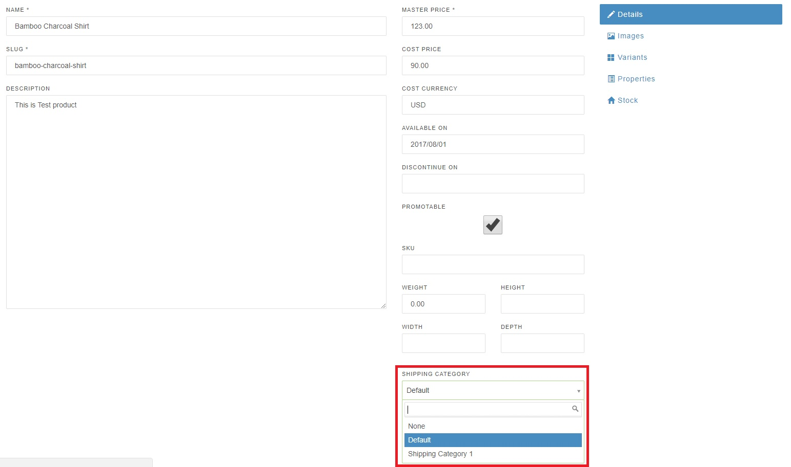

## Shipping Categories

Shipping Categories are used to address special shipping needs for one or more of your products. The most common use for shipping categories is when certain products cannot be shipped in the same box. This is often due to a size or material constraint.

For example, if a customer purchases a jump rope and a treadmill from an online exercise equipment store, the treadmill would be considered an over-sized item by most shipping carriers and would require special shipping arrangements. The jump rope could be sent via standard shipping.

To handle this use case in Spree you would define a "Default" shipping category for the jump rope and any other products that can use standard shipping methods, and an "Over-sized" shipping category for extremely large items like the treadmill. You would then assign the "Over-sized" shipping category to your treadmill product and the "Default" shipping category to your jump rope product.

During checkout, the shipping categories assigned to the products in your customer's order will be a key factor in determining which shipping methods and costs your Spree store offers to your customer at checkout.

### Creating a Shipping Category

To create a new shipping category, go to the Admin Interface, click the "Configuration" tab, click the "Shipping Categories" link, and then click the "New Shipping Category" button. Enter a name for your new shipping category and click the "Create" button.

### Adding a Shipping Category to a Product

Once you've created your shipping categories you can assign the appropriate category to each of your products. To associate a shipping category with a product, go to the Admin Interface, and click the "Products" tab. Then, click on the product that you would like to edit from the list that appears.

Once you are in edit mode for the product, select the shipping category you want to assign to the product from the "Shipping Categories" drop-down menu, and click "Update".

## Next Step

Now that you understand how Shipping Categories work, let's move on to the next piece of the Spree shipping system - shipping [zones](/user/shipments/zones.html).
