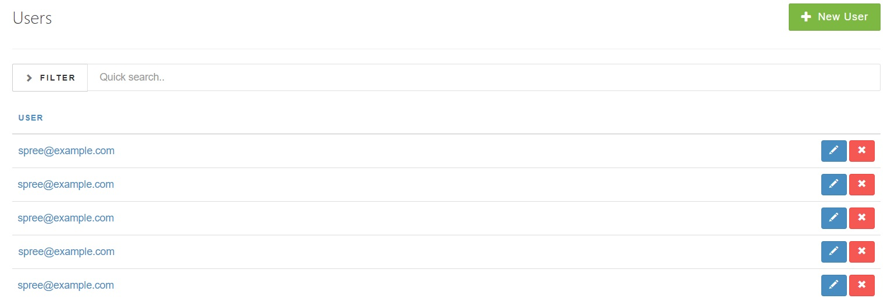

## Introduction

To create a new user for your store, go into the Admin Interface, click the **Users** tab, and click the **New User button**.

The three mandatory fields ("Email", "Password" and "Password Confirmation") and Roles checkboxes ("Admin" and "User" those are created by Spree default, there is possibility to extend Roles by backend work).

## Editing existing user

Once you have created an account you are redirected to User edition page about which you can find more [here](/user/users/editing_users.html).
