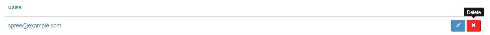

To delete a user in your store, go into the Admin Interface and click the **Users** tab. A list of your store's users will appear. Find the user that you would like to delete and click the "Delete" icon on the right to remove it from your store.

A message will appear asking you to confirm that you want to delete the user. Click "OK".

<alert kind="warning"> "Please be aware that you cannot delete users that has placed any orders in the past"</alert>
